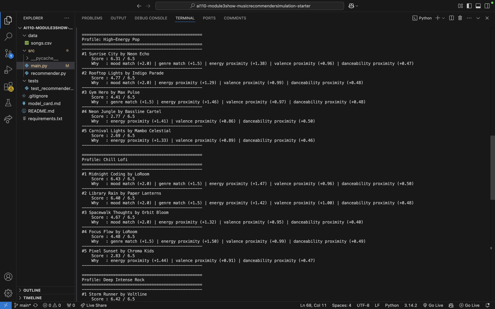
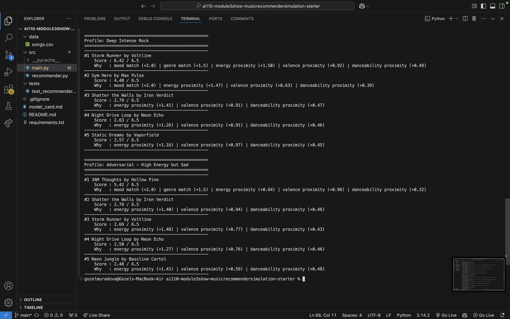

# 🎵 Music Recommender Simulation

## Project Summary

In this project you will build and explain a small music recommender system.

Your goal is to:

- Represent songs and a user "taste profile" as data
- Design a scoring rule that turns that data into recommendations
- Evaluate what your system gets right and wrong
- Reflect on how this mirrors real world AI recommenders

Replace this paragraph with your own summary of what your version does.

---

## How The System Works

Real-world recommenders like Spotify compare your listening history against
song attributes to find the closest match to your taste. My version does the
same thing on a small scale — it scores each song by measuring how close it
is to the user's preferences, then ranks the results highest to lowest.

**Song features:** genre, mood, energy, valence, tempo_bpm, danceability, acousticness

**UserProfile stores:** preferred genre, preferred mood, target energy, target valence, target danceability

### Algorithm Recipe

| Feature | Points | Method |
|---|---|---|
| Mood match | +2.0 | Exact match |
| Genre match | +1.5 | Exact match |
| Energy | up to +1.5 | 1.5 × (1 − abs(song − target)) |
| Valence | up to +1.0 | 1.0 × (1 − abs(song − target)) |
| Danceability | up to +0.5 | 0.5 × (1 − abs(song − target)) |

**Max possible score: 6.5 points.** Songs are ranked highest to lowest and the top k results are returned.

### Potential Biases

This system might over-prioritize genre, ignoring great songs that match the
user's mood but come from an unexpected genre. It also has no memory — every
session starts fresh with no learning from past listens.

---

## Getting Started

### Setup

1. Create a virtual environment (optional but recommended):

   ```bash
   python -m venv .venv
   source .venv/bin/activate      # Mac or Linux
   .venv\Scripts\activate         # Windows

2. Install dependencies

```bash
pip install -r requirements.txt
```

3. Run the app:

```bash
python -m src.main
```

### Running Tests

Run the starter tests with:

```bash
pytest
```

You can add more tests in `tests/test_recommender.py`.

---

## Experiments You Tried

Use this section to document the experiments you ran. For example:

- What happened when you changed the weight on genre from 2.0 to 0.5
- What happened when you added tempo or valence to the score
- How did your system behave for different types of users





- Chill Lofi and Deep Intense Rock both scored near 6.4/6.5 for their #1 result, confirming the scoring logic works when a clear match exists. - The adversarial profile (high energy + sad) ranked 3AM Thoughts #1 despite its low energy (0.33), because mood and genre bonus points (3.5 pts) outweighed the energy mismatch. This reveals that exact-match weights can override numeric proximity when the catalog is small. - No single song dominated every list, suggesting genre weight is balanced enough to avoid a hard filter bubble with this dataset.


-### Weight shift experiment
Doubled energy weight (1.5 → 3.0) and halved genre weight (1.5 → 0.75).

Result: Rankings shifted — songs with closer energy scores climbed even when
they had no genre match, while exact genre matches dropped if their energy
was off. This confirmed that genre weight was acting as a strong tiebreaker
in the original version. Reverted to original weights for the final version
since the original results felt more musically intuitive.

---

## Limitations and Risks

Summarize some limitations of your recommender.

Examples:

- It only works on a tiny catalog
- It does not understand lyrics or language
- It might over favor one genre or mood

You will go deeper on this in your model card.


The system has a strong mood/genre lock-in problem — because mood and genre
matches award fixed bonus points (2.0 and 1.5), a song that perfectly matches
both will almost always rank #1 regardless of how far off its numeric features
are. This was revealed by the adversarial profile, where a quiet low-energy
folk song ranked #1 for a user who wanted high-energy music, simply because
the mood and genre labels matched.

The dataset is also too small and unevenly distributed to avoid filter bubbles.
Lofi has 3 songs, pop has 2, and most other genres have only 1 — so a lofi user
will always see the same 2-3 songs at the top with very little variety. In a
real system this would push users into an increasingly narrow listening tunnel.

Finally, the system treats all users identically — there is no concept of
context. A user who wants chill music at midnight and high-energy music at the
gym is represented by a single static profile, which means half their actual
taste is always ignored.

---

## Reflection

Read and complete `model_card.md`:

[**Model Card**](model_card.md)

Write 1 to 2 paragraphs here about what you learned:

- about how recommenders turn data into predictions
- about where bias or unfairness could show up in systems like this


## Reflection

The biggest learning moment was the adversarial profile experiment — a quiet
folk song ranked #1 for a user who wanted high-energy music because mood and
genre bonus points overrode everything else. That made weighted scoring click
for me: the weights are decisions about what matters, not just numbers.

AI tools helped with boilerplate but I had to double-check the logic. At one
point the wrong dictionary keys would have silently scored every song zero
without throwing an error — AI code can look right and still be subtly wrong.

What surprised me is how simple math can still feel like a real recommendation.
When the right lofi songs surfaced for the right profile, it felt intelligent
even though it was just addition on five numbers. That gap made me more
skeptical of trusting real apps without understanding what they actually
optimize for.

---

## 7. `model_card_template.md`

Combines reflection and model card framing from the Module 3 guidance. :contentReference[oaicite:2]{index=2}  

```markdown
# 🎧 Model Card - Music Recommender Simulation

## 1. Model Name

Give your recommender a name, for example:

> VibeFinder 1.0

---

## 2. Intended Use

This model suggests 3 to 5 songs from a small catalog based on a user's
preferred genre, mood, and energy level. It is for classroom exploration
only, not for real users.

---

## 3. How It Works (Short Explanation)

Each song is given a score based on how well it matches the user's taste
profile. Mood and genre matches give bonus points. Energy, valence, and
danceability are scored by proximity — the closer the song's value is to
the user's target, the higher it scores. Songs are then ranked and the
top results are returned.

---

## 4. Data

- 20 songs total (10 starter + 10 added)
- Genres represented: pop, lofi, rock, ambient, jazz, synthwave, indie pop,
  r&b, hip-hop, classical, metal, indie folk, latin, electronic, country,
  soul, chillwave
- Moods represented: happy, chill, intense, relaxed, focused, moody,
  romantic, confident, peaceful, angry, sad, euphoric, nostalgic,
  melancholy, dreamy

---

## 5. Strengths

Where does your recommender work well

You can think about:
- Situations where the top results "felt right"
- Particular user profiles it served well
- Simplicity or transparency benefits

---

## 6. Limitations and Bias

Where does your recommender struggle

Some prompts:
- Does it ignore some genres or moods
- Does it treat all users as if they have the same taste shape
- Is it biased toward high energy or one genre by default
- How could this be unfair if used in a real product

---

## 7. Evaluation

How did you check your system

Examples:
- You tried multiple user profiles and wrote down whether the results matched your expectations
- You compared your simulation to what a real app like Spotify or YouTube tends to recommend
- You wrote tests for your scoring logic

You do not need a numeric metric, but if you used one, explain what it measures.

---

## 8. Future Work

If you had more time, how would you improve this recommender

Examples:

- Add support for multiple users and "group vibe" recommendations
- Balance diversity of songs instead of always picking the closest match
- Use more features, like tempo ranges or lyric themes

---

## 9. Personal Reflection

A few sentences about what you learned:

- What surprised you about how your system behaved
- How did building this change how you think about real music recommenders
- Where do you think human judgment still matters, even if the model seems "smart"

